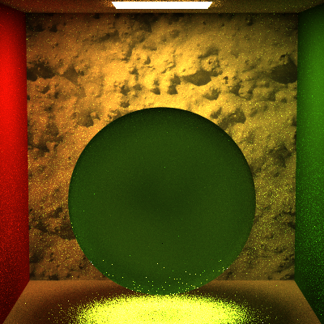
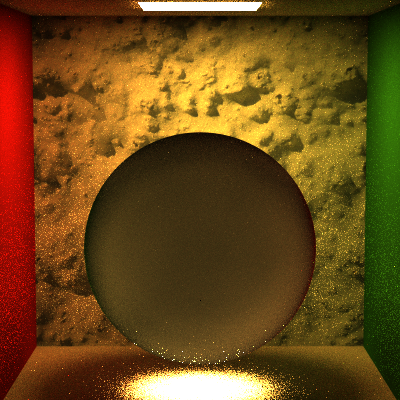
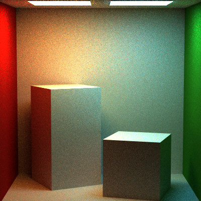
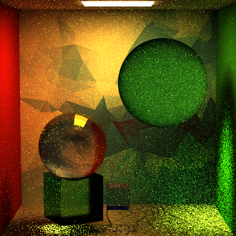
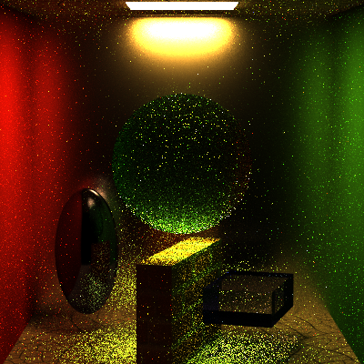
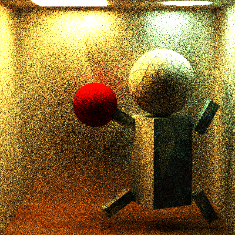
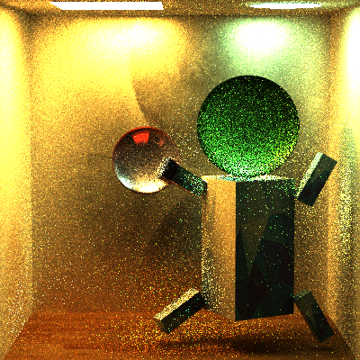

Path Tracer Episode V: Global Illumination Strikes Back
======================

**University of Pennsylvania, CIS 561: Advanced Computer Graphics, Homework 7**

======================

* Name: Xi Yang
* PennKey: 43486159

======================
Extra Credit:
------------
MicrofacetBTDF

I also wrote two material classes : MicrofacetTransmissiveMaterial and MicrofacetMaterial.
100 sample, 5 limit

MicrofacetTransmissiveMaterial: PT_MicrofacetTransmitBox.json

MicrofacetMaterial: PT_MicrofacetGlassBallBox.json
(But I dont know why that the reflection looks nearly no contribution.)

Results:
------------

twolightsCornell
------------
100 sample, 5 limit

Custom Scenes:
------------
All rendered with 400 sample, 8 limit

This scene contains three different kinds of transmissive materials, two specular(yellow sphere and small cube), one microfacet(bigger cube and green sphere).

This scene has chrome material and transmissive materials.

This scene has different transmissive materials and matteMaterials.
(I change the material of the ball from matte to glass)

