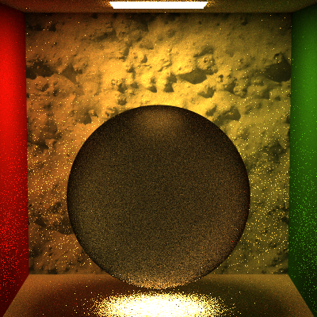
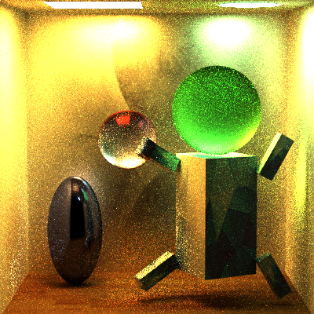
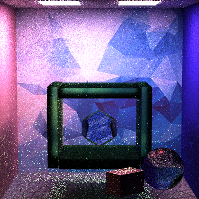
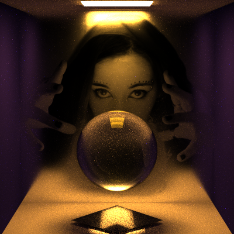

Path Tracer Episode V: Global Illumination Strikes Back
======================

**University of Pennsylvania, CIS 561: Advanced Computer Graphics, Homework 7**

======================

* Name: Xi Yang
* PennKey: 43486159

======================
Extra Credit:
------------
MicrofacetBTDF

I also wrote two material classes : MicrofacetTransmissiveMaterial and MicrofacetMaterial.
100 sample, 5 limit

MicrofacetTransmissiveMaterial: PT_MicrofacetTransmitBox.json

MicrofacetMaterial: PT_MicrofacetGlassBallBox.json

Results:
------------

twolightsCornell
------------
100 sample, 5 limit

Custom Scenes:
------------
All rendered with 400 sample, 8 limit

This scene contains three different kinds of transmissive materials, two specular(yellow sphere and small cube), one microfacet(bigger cube and green sphere).
(scene1.jason)

This scene has chrome material and transmissive materials. But there are so many fireflies.
(scene2.jason)

This scene has different transmissive materials and matteMaterials.
(scene3.jason)

This scene has a mesh obj and several materials(glass,microfacet glass, etc).
(scene4.jason)

This scene has a mirror, one glass ball and one mesh.
(scene5.jason)

